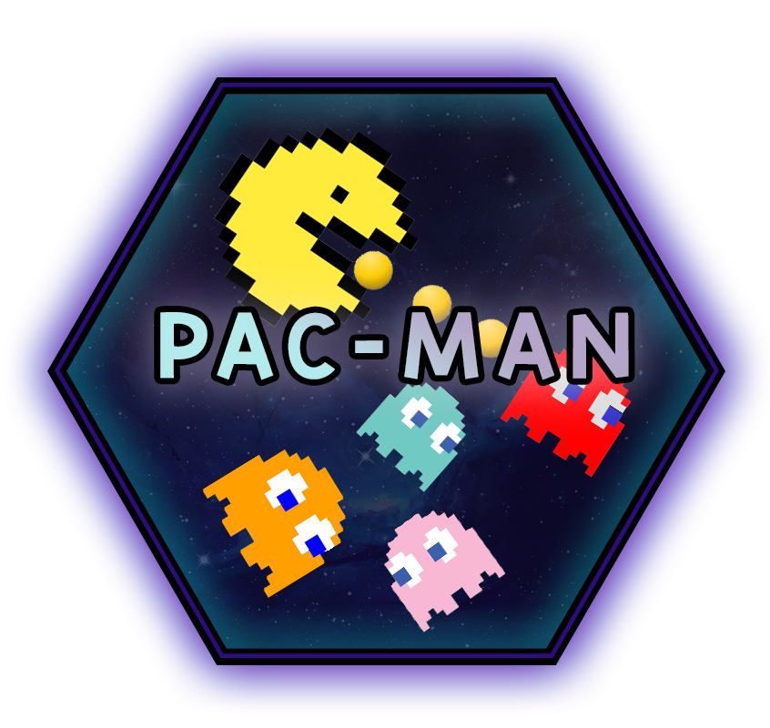

*This project has been created as part of the 42 curriculum by roandrie*

<p align="center">
  
</p>
<h3 align="center">
  <em>Recreate the famous arcade game Pac-man!</em>
</h3>

---

<div align="center">
  
  
</div>

## ⚠️ Disclaimer

- **Full Portfolio:** This repository focuses on this specific project. You can find my entire 42 curriculum 👉 [here](https://github.com/Overtekk/42).
- **Subject Rules:** I strictly follow the rules regarding 42 subjects; I cannot share the PDFs, but I explain the concepts in this README.
- **Archive State:** The code is preserved exactly as it was during evaluation (graded state). I do not update it, so you can see my progress and mistakes from that time.
- **Academic Integrity:** I encourage you to try the project yourself first. Use this repo only as a reference, not for copy-pasting. Be patient, you will succeed.

---

## ✏️ Quick Start

```bash
make  # install all dependencies and run the script

uv sync  # alternatively you can also use this

uv run python -m src  # Launch with the default value
```
> [!NOTE]
> If you don't have `uv` installed, run `make install`

---

## 📂 Description

todo

### 📜 Summary:

todo

### 📝 Rules:

todo

### 📮 Makefile:

todo

---

## 💡 Instructions

---

## ⚙️ How it works?

### Configuration

todo

### Maze Generation package

todo

### Implementation

todo

### General Software Architecture

todo

###

Project Management

---

## 📚 Resources

### Documentation
| Resource | Description |
| :------: | :---------: |

### Documentation for Arcade library
| Resource | Description |
| :------: | :---------: |
| [Arcade API](https://api.arcade.academy/en/3.3.3/index.html) | Official API of Arcade library |
|[Arcade Colors](https://api.arcade.academy/en/2.6.17/arcade.color.html)| Official colors of Arcade library |

### Other
| Resource | Description |
| :------: | :---------: |
| [Github of sousampere](https://github.com/sousampere) | Help with project management |
| [Arcadeblogger - Pacman documentary](https://arcadeblogger.com/2016/03/12/the-development-of-pacman/) | Documentary of the conception of Pacman |
| [Pacman Fandom](https://pacman.fandom.com/wiki/Maze_Ghost_AI_Behaviors) | Documentary for all ghost AI behaviors |

### IA was use to:
- **Refactoring** ― help to write better understand code, type hints some part of the code.
- **Help with the Arcade library** ― since the documentation is not well done, IA have helped to better understand what we can do and how.
- **Debugging** ― when bug occurs and we didn't know what cause did, IA help us understanding what goes wrong.

---
